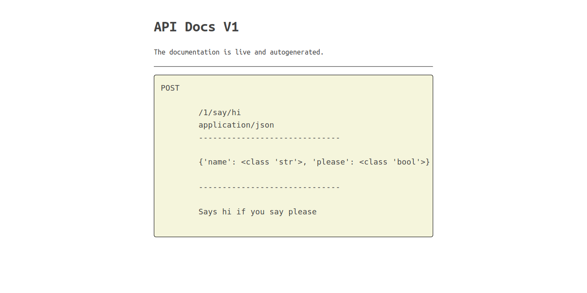

RedBull
=======

Quickly develop JSON apis.


- Auto OPTIONS
- All APIs are JSON, POST by default.
- Using static types APIs are auto-documented at `/<version>/docs`
- You're not locked in. You can still code the way your framework of choice expects you to.
- You can use any framework you want (Bottle, Flask, Django, Aiohttp ...)


Bottle Example
-----

```python
import bottle
from redbull import Manager

mg = Manager(bottle.Bottle(),
             apiversion='1')

@mg.api
def say_hi(name: str, please: bool, __args__, __kwargs__):
    "Says hi if you say please"
    if please:
        return 'hi ' + name
    return 'um hmm'

mg.finalize()  # or finaise.
mg.app.run()
```

This gives you a live docs page like:




Aiohttp Example
-----

```python
from aiohttp import web
from redbull import Manager

mg = Manager(web.Application(),
             apiversion='1')

# The function name say_hi becomes the api say/hi
# the args are treated as JSON keys. All args must by type annotated
# optional args are supported
# Simply return dict/string. Redbull wraps it for you in the appropriate object
@mg.api
async def say_hi(name: str,
                 please: bool,
                 lastname: str='Snow',  # A default is provided
                 __args__,  # The original args passed to the function by Aiohttp
                 __kwargs__):
    "Says hi if you say please"
    if please:
        return 'hi ' + name
    return 'um hmm'

# ADD a generous CORS for all routes using the OPTIONS method
# Add a `/<version>/docs` GET Page
mg.finalise()
web.run_app(mg.app)
```

Todo
----

- [ ] Flask
- [ ] Django
